# HW4-SHRI_DevTools

## Nerwork

*  ###  Дублирование ресурсов

    достаточно отсортировать по имени и мы сразу увидим достаточно большое колличество дублирующихся файлов

    2 раза подтягивает одно  и тоже изображение 
    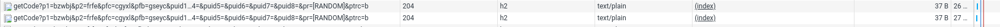
    p.s. я вижу три точки и смотрел полное имя файла, оно совпадает

    много повторяющихся либо с хожей функциональностью js файлов

     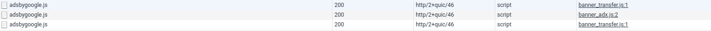

     2 раза подтягивает один и тот же файл сначала с google.ru, потом с google.com
    
    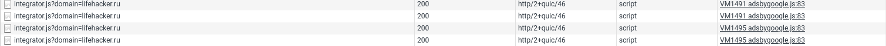

    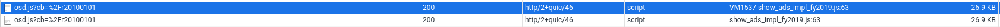  

    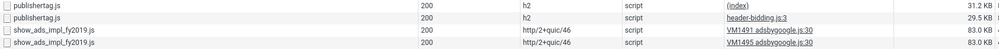

    так же есть повторяющиеся XHR/Fetch запросы
    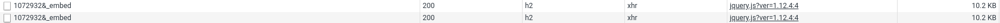

* ### Неоптимальные места / Лишний размер ресурса

    Несовсем понятно дублирование запросов
    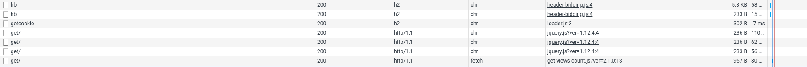

    подтягивание старых версий кода с новыми, у них явные проблемы с рефакторингом
    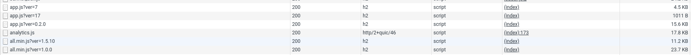

    тоже самое с css, по идеи новое должно перебивать старый код, получается старые версии стилей занимаю лишний размер

    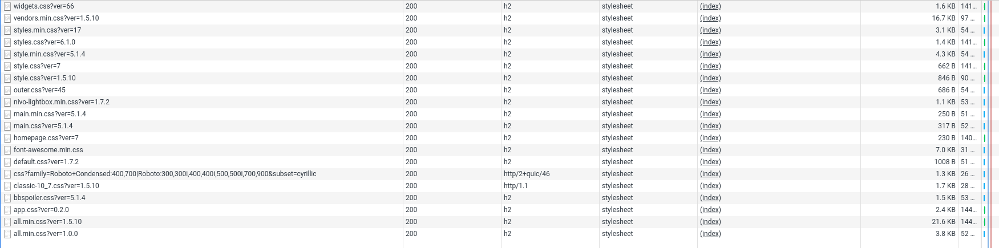

    В целом достаточно много js файлов просто забыли минифицировать

    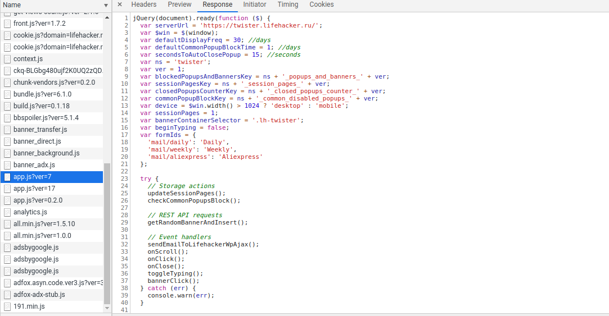

    а так выглядит сжатый

    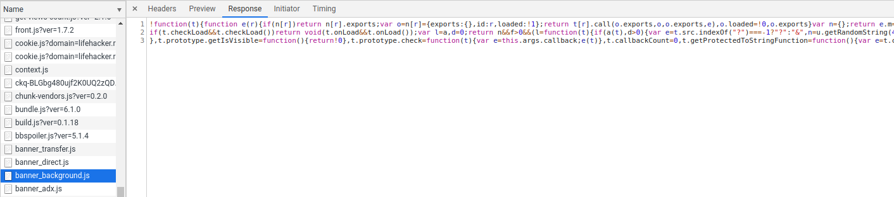

* ### Mедленно загружающиеся ресурсы / Ресурсы, блокирующие загрузку

    Долгая отдача ответа с сервера, больше ждем пока он обработает твой запрос, не жели сама скачка контента

    До того момента пока я не получу html у меня не буду подгружаться какие либо ресурсы да и рендерить будет нечего, пользователь секунду просто смотрит на белый фон, очень круто(нет)

    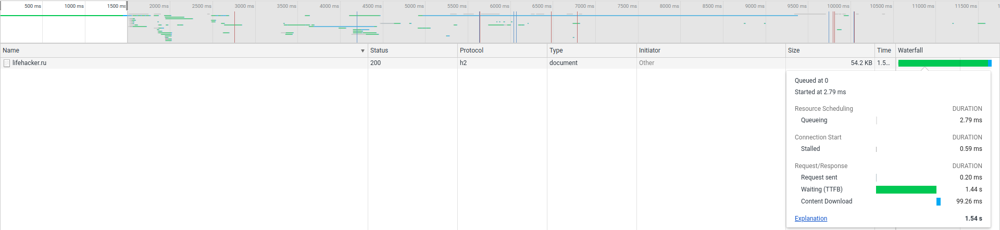

    c js ситуация не лучше 

    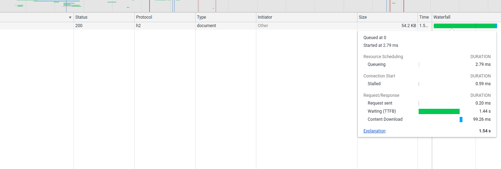

    сайт и так довольно долго грузиться, так еще и дублирущющие файлыы
    съедают достаточно много времени

    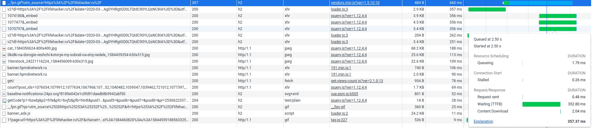

    несжатая картинка, которую я кстати так и не увиде на странице пролистав ее от и до, какие либо плагины у меня отключины

    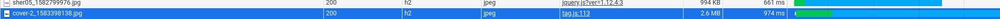
    p.s. свои картинки в readme я тоже не сжимаю, можете покарать)))

## Performance

* ### время в миллисекундах от начала навигации до событий 
    - ***First Paint*** 1673.8 ms
    - ***First Meaningful Paint*** 1673.8 ms
    - ***DOM Content Loaded*** 2878.5 ms
    - ***Load*** 6669.3 ms

* ### временя в миллисекундах на разные этапы обработки документа
    - ***Loading*** 145 ms
    - ***Scripting*** 12137 ms
    - ***Rendering*** 4914 ms
    - ***Painting*** 2231 ms

## Coverage

 * ### Cкриншот вкладки после загрузки страницы
    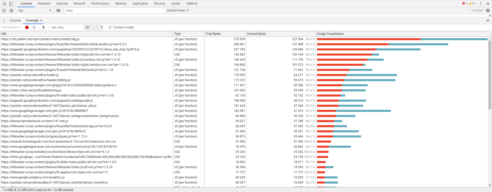

 * ***Oбъём неиспользованного CSS*** 387 KB
 * ***Объём неиспользованного JS*** 1.4 mb

## Audits
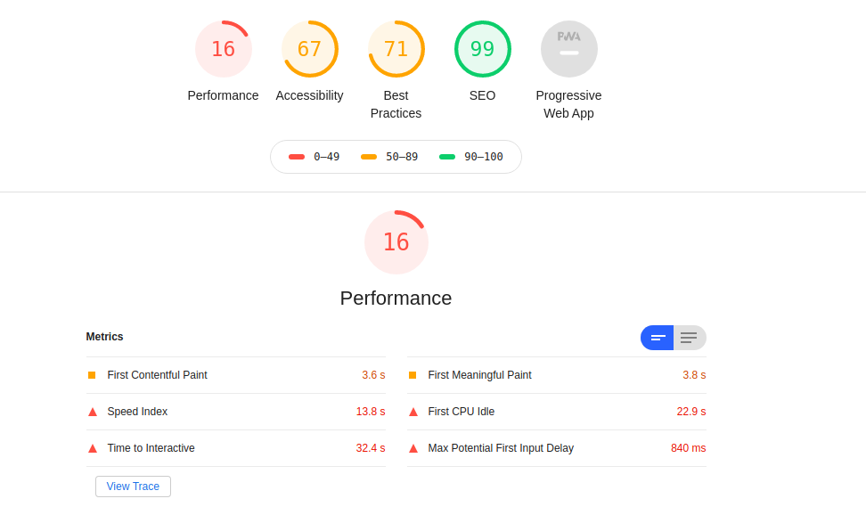

# Бонус - CPU 4x slowdown + Slow 3G

## Performance

* ### время в миллисекундах от начала навигации до событий
    - ***DOM Content Loaded:*** 24.65 s
    - ***Load*** 50.47s

* ### временя в миллисекундах на разные этапы обработки документа
    - ***Loading*** 227 ms
    - ***Scripting*** 6748 ms
    - ***Rendering*** 9153 ms
    - ***Painting***  394 ms